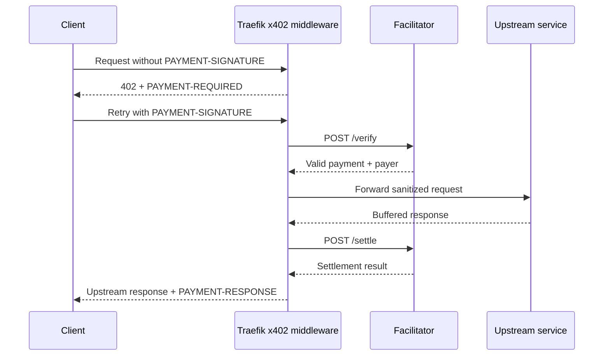

# Traefik x402 Middleware

[](https://github.com/wyh0626/traefik-x402/actions/workflows/ci.yml)
[](LICENSE)

A lightweight Traefik middleware that protects an existing HTTP service with
the x402 v2 `exact` payment flow. The upstream application does not need to
implement x402 or hold blockchain keys.

The plugin is implemented with the Go standard library so it can run in
Traefik's Yaegi plugin runtime. Cryptographic verification and settlement are
delegated to an x402 facilitator.

> This is an unofficial community plugin. It is not affiliated with or
> endorsed by Traefik Labs, Coinbase, or the x402 Foundation.

[中文文档](README.zh-CN.md)

## What it does

- Implements the x402 v2 `PAYMENT-REQUIRED`, `PAYMENT-SIGNATURE`, and
  `PAYMENT-RESPONSE` headers.
- Supports the fixed-price `exact` scheme.
- Calls the facilitator's `/verify` and `/settle` endpoints.
- Keeps wallet and settlement keys outside Traefik.
- Removes the client payment signature before forwarding by default.
- Replaces client-supplied payer identity with the verified payer.
- Allows `GET` and `HEAD` by default; mutating methods require explicit opt-in.
- Rejects concurrent reuse of the same signed payment authorization within one
  middleware instance.
- Forces settled responses to `private, no-store` so shared caches cannot
  bypass payment.
- Does not settle when the upstream returns HTTP 400 or later.
- Limits payment headers, facilitator responses, and buffered upstream bodies.

Every successful paid HTTP request normally creates one payment. This plugin
does not implement subscriptions, permanent access, `upto`, or batch settlement.

## Request flow



The middleware buffers an upstream response until settlement succeeds. If the
upstream returns HTTP 400 or later, settlement is skipped. If settlement fails,
protected response content is not released.

## Five-minute mock test

The mock test loads the plugin into a real Traefik v3.7 process and validates:

```text
402 challenge -> mock payment -> verify -> upstream -> settle -> 200
```

It requires Docker and does not use a wallet or blockchain:

```bash
docker compose -f e2e/docker-compose.yml up \
  --build --abort-on-container-exit --exit-code-from client
docker compose -f e2e/docker-compose.yml down --volumes
```

Expected output includes:

```text
PASS unpaid request: 402 + PAYMENT-REQUIRED
PASS paid request: verify -> upstream -> settle -> 200
PASS PAYMENT-RESPONSE returned to the client
```

The mock facilitator accepts a dummy payload. It validates middleware wiring,
not wallet signatures or real settlement.

Developers with a local Traefik binary can alternatively run:

```bash
TRAEFIK_BIN=/absolute/path/to/traefik ./e2e/run.sh
```

## Install from the Traefik Plugin Catalog

Declare the plugin in Traefik's static configuration and restart Traefik:

```yaml
experimental:
  plugins:
    x402:
      moduleName: github.com/wyh0626/traefik-x402
      version: v0.1.1
```

Then attach it to a router in dynamic configuration:

```yaml
http:
  routers:
    paid-api:
      rule: Host(`api.example.com`) && PathPrefix(`/v1/premium`)
      service: existing-api
      middlewares:
        - x402-payment

  middlewares:
    x402-payment:
      plugin:
        x402:
          facilitatorURL: https://x402.org/facilitator
          scheme: exact
          network: "eip155:84532"
          asset: "0x036CbD53842c5426634e7929541eC2318f3dCF7e"
          amount: "1000"
          payTo: "0xYourReceiverAddress"
          maxTimeoutSeconds: 60
          allowedMethods:
            - GET
            - HEAD
          description: Premium API
          mimeType: application/json
          extra:
            name: USDC
            version: "2"

  services:
    existing-api:
      loadBalancer:
        servers:
          - url: http://existing-api:8080
```

`amount` is expressed in the asset's atomic unit. USDC uses six decimal places,
so `1000` is `0.001` USDC.

See [installation](docs/installation.md) and the full
[configuration reference](docs/configuration.md) for Docker labels, file
provider, and Kubernetes examples.

## Real Base Sepolia payment

The repository includes a self-contained Go x402 client and an interactive test
that creates one real Base Sepolia testnet USDC payment:

```bash
cd e2e/real
PAY_TO=0xYourReceiverAddress ./run.sh
```

In another terminal:

```bash
cd e2e/real
./pay.sh
```

The script displays the challenge, amount, asset, network, and receiver before
asking for confirmation and a dedicated test-wallet private key. The key is read
without echo and is never written to disk. Follow the complete
[Base Sepolia test guide](e2e/real/README.md).

## Supported scope

| Capability | Status |
| --- | --- |
| x402 protocol | v2 |
| Payment scheme | `exact` only |
| Network family | EVM (`eip155:*`) only in v0.1.x |
| Facilitator | HTTP `/verify` and `/settle` |
| Existing HTTP upstream | Supported |
| HTTP methods | `GET`, `HEAD` by default; configurable |
| Multiple prices | Use multiple middleware instances |
| Trusted payer header | `X-X402-Payer` by default |
| SSE / WebSocket / streaming | Not supported |
| Large downloads | Not recommended |
| `upto` / batch settlement | Not supported |
| Subscription / permanent access | Not supported |

## Important limitations

- Successful upstream responses are buffered, with a default 10 MiB limit.
- Settled responses disable browser and shared-proxy caching. Do not override
  these headers in a middleware placed after x402.
- Do not attach the middleware to SSE, WebSocket, indefinite streaming, or
  large-download routes.
- The upstream operation runs before settlement. `POST`, `PUT`, `PATCH`, and
  `DELETE` are disabled until added to `allowedMethods`; opted-in mutations must
  be idempotent because an upstream side effect cannot be rolled back if
  settlement later fails.
- The in-flight duplicate guard uses the signed EVM authorization identity and
  is local to one middleware instance. Sequential replay and multi-replica
  protection still depend on facilitator guarantees and upstream idempotency.
- Public testnet facilitators are not a default production mainnet strategy.
- Scheme-specific cryptographic validation is delegated to the facilitator.

Read [security considerations](docs/security.md) and
[troubleshooting](docs/troubleshooting.md) before production use.

## Development

```bash
gofmt -w .
go vet ./...
go test -race ./...
```

See [CONTRIBUTING.md](CONTRIBUTING.md) for the complete development workflow.

## License

Apache License 2.0. See [LICENSE](LICENSE) and [NOTICE](NOTICE).
